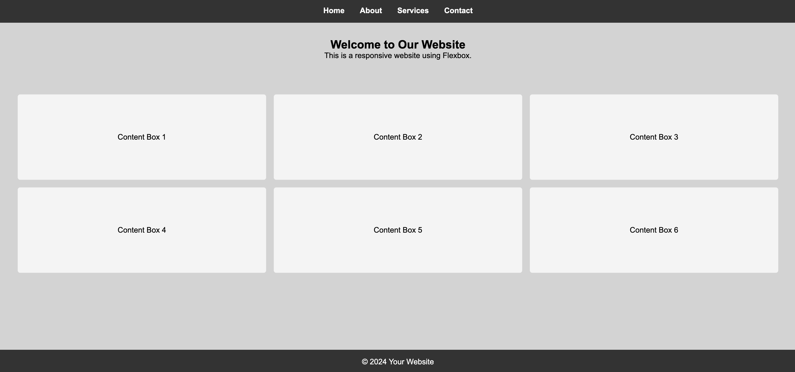

# Intermediate Flexbox



## Description 📄
In this assignment you will cover how to create a responsive website using Flexbox. 
You will build a simple webpage that includes a navigation bar, a main section, and a footer. 
The website will be responsive, meaning it will look good on devices of all sizes.

## Expected Project Structure 🏗️

```
responsive_flexbox
│   index.html
│   style.css
```


## 1. **Create the Project Folder and Files**
   - [ ] Create a folder named `responsive_flexbox` to store all your project files.
   
   - [ ] Inside the `responsive_flexbox` folder, create a file named `index.html`. This will be your main HTML file.
   
   - [ ] In the `responsive_flexbox` folder, create another file named `styles.css`. This file will contain the CSS used to style your HTML content.

## 2. **Start with an HTML Boilerplate**
Now that you have your files set up, start by adding the basic HTML5 boilerplate.

  - [ ] Open your currently empty index.html file and add the following code to it.

```html
<!DOCTYPE html>
<html lang="en">
  <head>
    <meta charset="UTF-8" />
    <meta name="viewport" content="width=device-width, initial-scale=1.0" />
    <title>Responsive Flexbox Website</title>
    <link rel="stylesheet" href="style.css" />
  </head>
  <body>
    <!-- Content goes here -->
  </body>
</html>
```

**Explanation:**
- Declares the document as HTML5 and sets up the essential metadata and styles.

## 3. **Add the Navigation Bar**
In this step, you will add a simple navigation bar to the webpage, providing links to key sections.

 - [ ] In `index.html`, within the `<body>` tags, add the following code for the navigation bar:

```html
<header>
  <nav>
    <ul>
      <li><a href="#">Home</a></li>
      <li><a href="#">About</a></li>
      <li><a href="#">Services</a></li>
      <li><a href="#">Contact</a></li>
    </ul>
  </nav>
</header>
```

**Explanation:**
- You inserted a navigation bar within a <header> section of your `index.html` file, using an unordered list to organize the links.

## 4. **Add the Main Section**
You will now add the main content section to the webpage, which includes multiple content boxes arranged using Flexbox.

- [ ] In `index.html`, below the navigation bar code after the `</header>` tag, add the following code for the main section:

```html
<main>
  <section class="hero">
    <h1>Welcome to Your Website</h1>
    <p>This is a responsive website using Flexbox.</p>
  </section>
  <section class="content">
    <div class="box">Content Box 1</div>
    <div class="box">Content Box 2</div>
    <div class="box">Content Box 3</div>
    <div class="box">Content Box 4</div>
    <div class="box">Content Box 5</div>
    <div class="box">Content Box 6</div>
  </section>
</main>
```

**Explanation:**
- This code creates the main content area of the webpage using a layout of six content boxes for displaying key information.


## 5. **Add the Footer**
In this step, you will add a footer to the webpage to display copyright information at the bottom.

- [ ] In `index.html`, below the main section code after the `</main>` tag, add the following code for the footer:

```html
<footer>
  <p>&copy; 2024 Your Website</p>
</footer>
```

**Explanation:**
- The code uses the `<footer>` tag to define the footer area, with a `<p>` tag displaying the copyright information and the website name.


## 6. **CSS for Basic Reset and Body Styles**
You will add CSS styles to reset default browser styles and define the basic layout and appearance of the webpage's body.

- [ ] Open `style.css` and add the following styles:

```css
* {
  margin: 0;
  padding: 0;
  box-sizing: border-box;
}

html,
body {
  height: 100%;
}

main {
  flex: 1;
}

body {
  font-family: Arial, sans-serif;
  min-height: 100vh;
  display: flex;
  flex-direction: column;
  background-color: lightgray;
}
```

**Explanation:**
- The code resets margins, padding, and sets consistent box-sizing across all elements.
- It also  defines the body as a flex container that spans the full height of the viewport. 
- The body is styled with a background color and uses Flexbox to arrange the page layout.

## 7. **Style the Header and Navigation Bar**
You will style the header and navigation bar to enhance the visual appearance and layout of the top section of the webpage.

- [ ] Open `style.css` and add the following styles:

```css
header {
  background-color: #333;
  color: white;
  padding: 1em 0;
}

nav ul {
  display: flex;
  justify-content: center;
  list-style: none;
}

nav ul li {
  margin: 0 1em;
}

nav ul li a {
  color: white;
  text-decoration: none;
  font-weight: bold;
}
```

**Explanation:**
- The code styles the header with a dark background and white text, adding padding for spacing. 
- The nav ul is made a flex container to center the navigation items, with the list-style removed. 
- Spacing is added between each navigation item using nav ul li, and the links are styled as well.

## 8. **Style the Hero Section**
In this step, you will style the hero section to ensure it is visually centered and occupies the appropriate space within the webpage.

- [ ] Open `style.css` and add the following styles:

```css
.hero {
  text-align: center;
  padding: 2em 0;
  color: Black;
  display: flex;
  flex-direction: column;
  align-items: center;
  justify-content: center;
  flex: 1;
}
```

**Explanation:**
- The code centers the hero section both horizontally and vertically using text-align: center and Flexbox, while padding adds spacing. 
- The section is a flex container with content arranged in a centered column, and flex: 1 allows it to expand to fill available space.


## 9. **Style the Content Section**
In this step, you will style the content section to create a responsive, well-spaced layout for the content boxes.

- [ ] Open `style.css` and add the following styles:

```css
.content {
  display: flex;
  justify-content: space-between;
  padding: 2em;
  flex-wrap: wrap;
  flex: 1;
}

.content .box {
  background-color: #f4f4f4;
  padding: 5em;
  width: 30%;
  text-align: center;
  border-radius: 5px;
  margin-bottom: 1em;
  flex: 1 1 400px;
  margin: 0.5em;
}
```

**Explanation:**
The content section is a flex container with evenly spaced, responsive boxes that wrap when necessary.
 Each box is styled with padding, a light background, centered text, and a minimum width of 400px, with margins adding space between them.

## 10. **Style the Footer**
In this step, you will style the footer to match the overall design by giving it a dark background, white text, and centered alignment.

- [ ] Lastly, open `style.css` and add the following styles:

```css
footer {
  background-color: #333;
  color: white;
  text-align: center;
  padding: 1em 0;
}
```

**Explanation:**
- The `footer` selector is styled with a dark background color and white text, similar to the header, and centered text with padding on the top and bottom.

## 11. **Testing Your Layout**
Now, you will test the responsiveness of your layout by resizing the browser window and adding more content.


- [ ] Resize the browser window to see how the Flexbox layout adapts to different screen sizes.
- [ ] Copy and paste the HTML boxes a few more times to see how Flexbox handles the additional content.
- [ ] Resize the window again to observe how the layout remains responsive.

**Explanation:**
- We’ll check how the Flexbox layout adjusts to different screen sizes and manages additional content, ensuring it stays responsive and properly structured.


## 12. **Commit and Push to Github**
 - [ ] Commit and push your work to Github.

##

# Conclusion 📄
You've now covered the fundamentals of building a responsive website using Flexbox. You progressively added and styled key sections of the webpage, including a navigation bar, main content area, and footer. You applied Flexbox techniques to create a layout that adapts smoothly to different screen sizes. Finally, you tested your layout to see how Flexbox handles various scenarios. You’ve now gained hands-on experience in creating a responsive webpage that looks great on any device.

##

### Solution codebase 👀
🛑 **Only use this as a reference** 🛑

💾 **Not something to copy and paste** 💾

**Note:**  This lab references a solution file located [here](https://github.com/HackerUSA-CE/aisd-wde-4-Intermediate-flexbox/tree/solution) (link not shown).

---

© All rights reserved to ThriveDX
